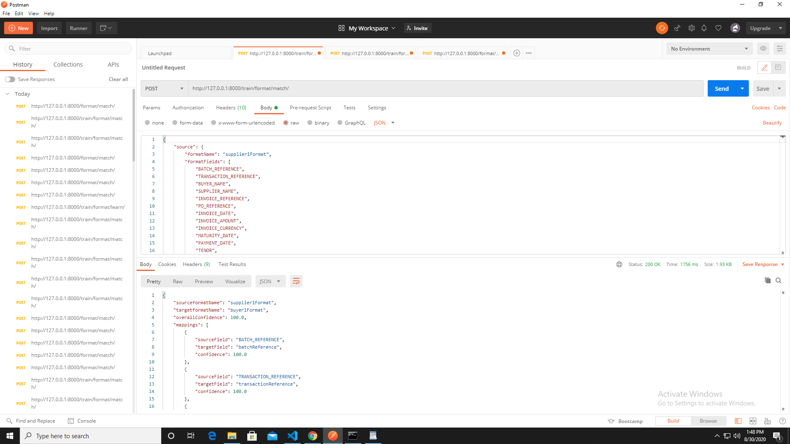
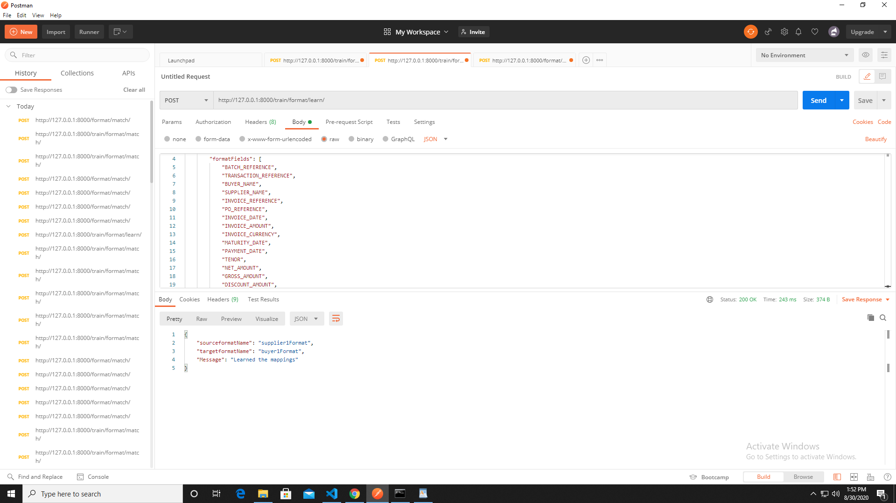
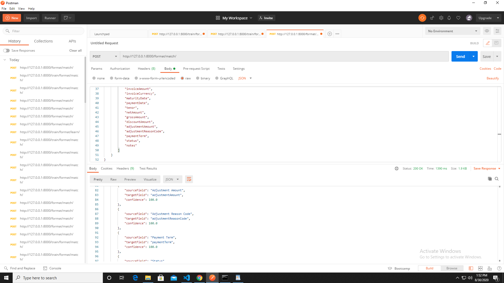

# ML-based-String-Matching
Mapping treatment for invoice data ingestion

INSTALLATION

1) Download or clone this repository.

2) If downloaded, Unzip the compressed folder containing the application into a suitable directory of your choice.

3) Go to the downloaded or cloned folder and activate virtual environment:

Example for Windows : (I have my repository in "D:")

=> Type following commands in Command Prompt :

i) d:

ii) cd ML-based-String-Matching

iii) .\Scripts\activate

4) Now go to assignment folder which is in current directory to run our Django project.

=> Continue in Command Prompt where we left in step iii :

iv) cd assignment

v) python manage.py makemigrations

vi) python manage.py migrate

vii) python manage.py runserver

5) Take the HTTP address from the line beginning with "Starting development server at...".Put that web address into a web browser of your choice and go to it. The URL you enter should look something like this: http://127.0.0.1:8000

6) You now have the Django application running.

7) There will be no homepage at http://127.0.0.1:8000 , so you will get "Page not found" (404) Error!

8) To access API:

=> API 1 - Matching in Supervised mode : POST http://localhost:NNNN/train/format/match
    
    Goto http://127.0.0.1:8000/train/format/match/

    

=> API 2 - Training the service : POST http://localhost:NNNN/train/format/learn
    
    Goto http://127.0.0.1:8000/train/format/learn/

    

=> API 3 - Format matching Automation : POST http://localhost:NNNN/format/match
 
    Goto http://127.0.0.1:8000/format/match/

    

